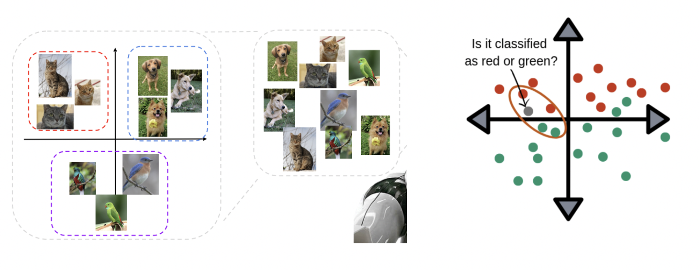
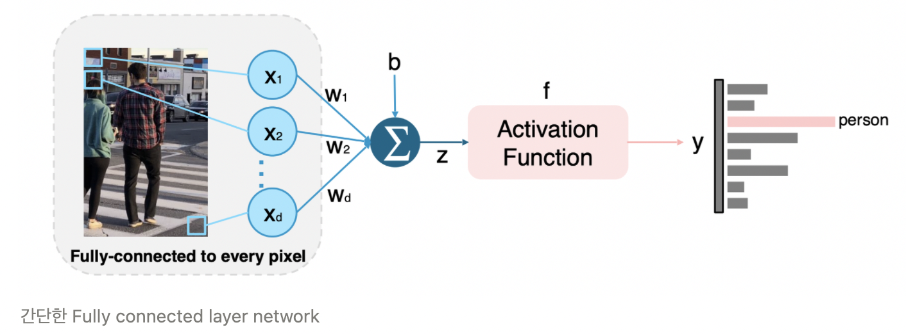
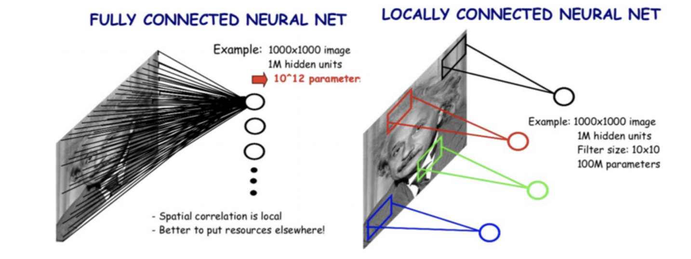

# Image Classification

Week: 8주차

# What is Computer Vision?

먼저, Computer Graphics(Rendering)에 대해 알아보자.

**Computer Graphics : 컴퓨터를 이용해 실제 세계의 영상을 조작하거나 새로운 영상을 만들어내는 기술**

즉 어떠한 input값에 대한 output이 영상이 된다.

그렇다면 Computer Vision이란?

**Computer Vision : input값인 visual data 대해 의미있는 정보를 추출하는 기술**

 여기서 output은 어떠한 class가 될 수 있다.

<aside>
💡 **Computer Graphics(Rendering) ↔️ Computer Vision(Inverse Rendering)**

</aside>

⇒  서로 역관계를 형성한다.

# Image Classification

Input인 Image에 대해 Classifier를 통해 Output(class)를 나타내는 것

이런 classification 문제는 k Nearest Neighbors(k-NN) 문제를 통해 해결될 수 있다.

k-NN : Label 정보를 기반으로 주위에 어떤 데이터가 주로 분포되어 있는 지를 파악하는 기술

*하지만 각 class를 나누는 기준을 정하는 것도 쉬운 task는 아니다.*

우리는 일반적으로 Neural Network에 다양한 영상데이터들을 녹여 넣어서 classification을 한다.

그 중 가장 기반이 되는 neural network가 CNN이다.

### Neural Network

간단한 Fully connected layer network

각각의 pixel에 대해 서로 다른 가중치로 weighted sum을 하고 Non-Linear Activation Function을 활용하여 분류스코어로 출력한다.

하지만 이 간단한 모델은 Layer가 한 층이기 때문에 단순하다. 따라서 평균적인 이미지 이외에는 표현이 어렵다.

또 한가지 문제는 template의 위치나 스케일에 따라 결과가 달라질 수 있다. (쉽게 말하면 Crop된 이미지가 어떤 부분을 표현하냐에 따라 결과가 쉽게 달라진다.)

즉, 너무 단순하기에 어려운 task에서 사용이 어렵다는 것이다.

## CNN : Convolution Neural Network

Fully → Locally

국부적인 영역을 활용하여 파라미터의 수가 획기적으로 줄어들게 된다.

**CNN은 sliding window 방식을 사용한 Locally connected neural network 방식을 통해 결과를 추출한다.**

<aside>
❓ CNN은 fully가 아닌 locally connected neural network가 맞는가?

</aside>

**이런 CNN은 현재 많은 CV task에서 backbone 역할을 한다.**